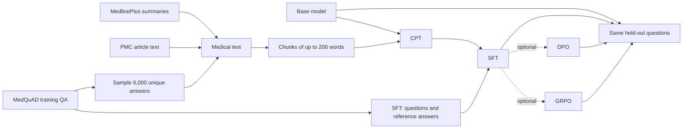

# Medical Question Answering Model: Research and Data Preparation

Updated: 2026-09-27. The submitted proposal remains unchanged. This document records the current experiment plan and v3 data status. See the [简体中文版](README.md).

## Project question

We selected Qwen3.5-2B-Base for a small medical question-answering prototype. We want to learn whether it can draft answers to common health questions for online healthcare staff to review. If a small model can produce useful drafts at a low operating cost, it may reduce time spent answering repetitive questions. This is a course experiment, not a diagnostic system or a replacement for a clinician.

The main workflow is **Base → CPT → SFT**. Continued pretraining (CPT) lets the model learn from medical text. Supervised fine-tuning (SFT) then teaches it to answer questions. The main comparison is the Base model versus the final CPT+SFT model on the same held-out questions. This measures the overall training pipeline; it cannot isolate how much CPT contributes beyond SFT. That differs from the submitted proposal, which planned to compare CPT+SFT with SFT alone. The final report should explain this change in scope and why it was made.

DPO and GRPO are optional extensions if time, data, and the TensorFlow/Keras toolchain allow. Both would branch from the same SFT checkpoint. DPO needs pairs of preferred and less-preferred answers. GRPO also needs a clear and reliable scoring rule. These datasets, reward methods, and training implementations are not yet defined, so they are not part of the core plan.

## What the datasets contain

| Source | Original data and preparation | Current use |
|---|---|---|
| [MedQuAD](https://github.com/abachaa/MedQuAD) | Each XML source file can contain one or more question-answer pairs. The archive has 11,264 XML files; 5,486 contain at least one complete pair. After cleaning and deduplication, there are **16,359 complete pairs**: 12,799 train, 1,713 validation, and 1,847 test, split by source URL. | SFT still uses all 12,799 training pairs. There are 12,371 distinct training answer texts available for CPT; v3 uses a fixed random sample of 6,000 to reduce the answer-text share in CPT. |
| [MedlinePlus Health Topic XML](https://medlineplus.gov/xml.html) | Each health topic has a title, language, URL, and a plain-language summary. The downloaded version is dated 2026-09-26 and contains 2,033 topics. After excluding 187 pages linked to MedQuAD validation/test records, non-English topics, and topics without summaries, 827 English summaries remain: 813 train and 14 validation. Embedded HTML tags were removed while keeping their visible text. | All are kept for CPT. With a limit of 200 whitespace-separated words per chunk, they produce 1,758 train chunks and 50 validation chunks. |
| [PMC Open Access](https://pmc.ncbi.nlm.nih.gov/tools/textmining/) | Each JATS XML article includes a title, abstract, sectioned body, and references. We searched up to 20 common MedQuAD topics, requesting up to 30 articles per topic and filtering by article-level CC BY/CC0 license metadata. We selected 571 articles; 9 correction, retraction, or similar notice records were removed, leaving 562: 502 train and 60 validation. Titles, abstracts, and body text are extracted; references and tables are skipped. | The article text is split into chunks of up to 200 whitespace-separated words, yielding 13,118 training chunks and 1,595 validation chunks. PMC licenses vary by article; the manifest preserves each license. See [PMC’s official guidance](https://pmc.ncbi.nlm.nih.gov/tools/textmining/). |

The original MedQuAD SFT rows contain a `question`, a reference `answer`, and fields such as topic and source URL. CPT uses plain text as learning material: MedQuAD answer text, MedlinePlus topic title plus summary, or PMC article title, abstract, and body. CPT JSONL rows keep the text, source, document ID, and license metadata. Long documents are split into smaller rows with a `chunk_index`.

Simplified examples: an SFT row is `{"question":"What is asthma?","answer":"Asthma is ..."}`. A CPT row can look like `{"text":"[one chunk from the paper]","source":"PMC","document":"PMC...","chunk_index":3,"license":"CC BY"}`. Chunks target 200 whitespace-separated words for the planned 512-token input length. A word is not the same as a tokenizer token, and KerasHub pads or truncates text to a fixed sequence length. See the [KerasHub preprocessor documentation](https://keras.io/keras_hub/api/base_classes/causal_lm_preprocessor/). Before full training on the server, verify chunk lengths with the actual tokenizer so chunks are not heavily truncated.

## v3 CPT mixture

The v3 CPT training set contains **24,240 text chunks**:

- MedQuAD: 6,000 sampled answer texts become 9,364 chunks from 3,086 XML source documents.
- MedlinePlus: 813 health topics become 1,758 chunks.
- PMC: 502 training papers become 13,118 chunks.

The CPT validation set contains 1,645 chunks: 50 MedlinePlus chunks and 1,595 PMC chunks, from 14 MedlinePlus topics and 60 papers. The MedQuAD SFT training split remains complete.

By a rough whitespace-separated word count, the training text totals about **4.07 million words**: about 2.57 million from PMC (63%), 1.22 million from MedQuAD (30%), and 0.28 million from MedlinePlus (7%). These are not model-token counts. The course instructions call for at least 10,000 text documents. We count each prepared CPT chunk as one training example, giving 24,240. We also report the underlying source-document IDs: 4,401 in the training set, so chunk counts are not mistaken for distinct articles.

## Data flow and evaluation

The original MedQuAD splits remain unchanged. Separate cleaned evaluation files contain 1,471 validation questions and 1,573 test questions. They remove questions or answers that exactly repeat SFT training content. The current checks cover exact duplicates and some full-answer matches; they do not include a semantic near-duplicate audit, so they cannot guarantee that all knowledge overlap is gone.

The Base and final SFT models should use the same questions, prompt, and generation settings. Planned evaluation includes automatic text-matching metrics and a manual sample review for relevance, missing information, and unsupported claims. The metrics and human-scoring rubric are not yet fixed. Similarity to a reference answer does not prove medical correctness or provide clinical validation.

## Current status

- MedQuAD, MedlinePlus, and 571 PMC articles have been downloaded. The v3 CPT corpus has been cleaned, sampled, and chunked.
- The current manifest is `data/processed/cpt-medical-v3/manifest.json`. v1 and v2 remain available. Raw and processed data are not tracked by Git and must be transferred to the training server separately.
- Full Qwen3.5-2B CPT, SFT, evaluation code, and training have not been completed. The locked KerasHub version includes the Qwen3.5 preset and model classes, but this project's actual model loading, training, and LoRA target layers have not been verified on the server. The existing GPU smoke run used the older Qwen2.5-0.5B path and does not verify the 2B setup.
- Training targets a Linux GPU server with dependencies managed by `uv`. WSL is not needed to prepare or inspect the data locally.

If DPO or GRPO is attempted later, both should branch independently from the same SFT checkpoint. Define and version the preference data, reward rule, and evaluation set before starting. A higher reward score alone does not prove that answers improved. If the toolchain or data are not ready in time, complete the Base→CPT→SFT workflow.

## Recommended reading

- [BioMedLM: A 2.7B Parameter Language Model Trained On Biomedical Text](https://arxiv.org/abs/2403.18421): a reference for the order of medical-text training followed by question-answer fine-tuning. It trains from scratch with far more data and compute, so its scale is not copied here.
- [Don't Stop Pretraining: Adapt Language Models to Domains and Tasks](https://aclanthology.org/2020.acl-main.740/): studies continued training on domain text followed by task adaptation, which helps explain the role of CPT in this project.
