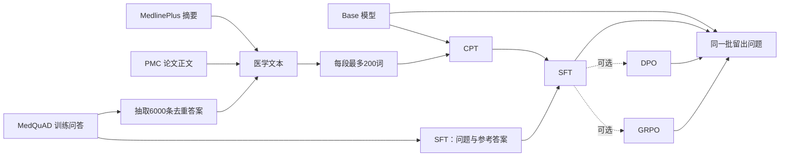

# 医学问答模型：研究与数据准备

**语言 / Language:** 简体中文 | [English](README.en.md)

更新：2026-10-05。已提交的 proposal 保留原稿；本文件记录实验方案、已完成的 CPT/SFT 和教授要求的基础模型对照。

## 项目要回答什么

我们选择 Qwen3.5-2B-Base，训练一个小型医学问答模型原型，研究它能否帮助线上医疗平台的工作人员起草常见健康问题的回答，再由工作人员审核。平台如果能以较低运行成本生成可用草稿，可能减少员工重复答疑的时间。它是课程实验，不用于诊断或替代医生。

主线是 **Base → CPT → SFT**：CPT（继续预训练）让模型读医学文本；SFT（监督微调）再让它根据问题生成答案。主比较是 Base 和最终 CPT+SFT 模型在同一批留出问题上的表现。这个比较衡量整个训练流程的变化，不能单独证明 CPT 比 SFT 多带来了多少提升；这与已提交 proposal 中“CPT+SFT 对比仅 SFT”的原计划不同，最终报告需要说明这次范围调整及原因。

DPO 和 GRPO 暂作可选扩展：如果时间、数据和 TensorFlow/Keras 工具链允许，就从同一个 SFT 检查点分别继续训练。DPO 需要“较好回答/较差回答”成对数据；GRPO 还需要明确、可信的奖励打分规则。目前这些数据、奖励方式和训练实现都未确定，不能算核心计划。

教授反馈已确认：至少 10,000 条医学文本或问答对满足数据要求；主要实验继续使用 TensorFlow/Keras/KerasHub，并必须补充课堂基础架构 baseline。我们选用从零训练的单向 LSTM 语言模型，结构为 Embedding(128) → LSTM(256) → Dense，词表上限 20,000、最大约 810 万参数。使用与 SFT 相同的 12,799 条训练问答和验证集，最多训练 5 个 epoch，再在相同 200 道测试题上比较回答的 Token F1、ROUGE-L 和模型成本。训练入口和命令见根目录 README；pilot、5 个 epoch 的全量训练和 200 题测试评测均已完成，训练记录保存在服务器 `runs/lstm_qa_full/run.json`。

LSTM 可以生成文字，但有限数据下的回答可能重复或不切题。它的单词 tokenizer 与 Qwen 子词 tokenizer 不同，因此 perplexity 只在 LSTM 自己的词表内报告，不能跨模型直接比较；输入和输出 token 上限也不完全等价。Qwen 的大规模预训练知识和模型规模都影响结果，不能把性能差距全部归因于架构。基础模型对照已完成；下一步补充公开 benchmark 和人工答案审查。

## 数据是什么样的

| 来源 | 原始内容与处理结果 | 当前用途 |
|---|---|---|
| [MedQuAD](https://github.com/abachaa/MedQuAD) | XML 来源文档中包含一条或多条问答。原压缩包有 11,264 个 XML 文件，其中 5,486 个至少含一条完整问答。清洗并去重后有 **16,359 对完整问答**：训练 12,799、验证 1,713、测试 1,847，按来源网址划分。 | SFT 仍使用全部 12,799 条训练问答。可供 CPT 使用的去重答案有 12,371 条；v3 固定随机抽取 6,000 条，降低答案文本在 CPT 中的占比。 |
| [MedlinePlus Health Topic XML](https://medlineplus.gov/xml.html) | 每个健康主题有标题、语言、网址和面向普通读者的摘要。下载版本日期为 2026-09-26，共 2,033 个主题；排除 187 个对应 MedQuAD 验证/测试页面的主题、非英文主题和缺摘要记录后，留下 827 个英文摘要：813 条训练、14 条验证。摘要中嵌入的 HTML 标签已剥除，保留其可见文字。 | 全部保留作 CPT；按每段最多 200 个空格分词切块后，训练集为 1,758 段、验证集为 50 段。 |
| [PMC Open Access](https://pmc.ncbi.nlm.nih.gov/tools/textmining/) | JATS XML 文章包含标题、摘要、分节正文和参考文献。我们从 MedQuAD 常见主题中抽取最多 20 个主题、每个最多 30 篇，并按文章元数据筛选 CC BY/CC0 许可。共选取 571 篇；清理时排除 9 篇更正、撤稿等声明类记录，留下 562 篇：502 篇训练、60 篇验证。提取标题、摘要和正文，跳过参考文献、表格等噪声。 | 文章正文按每段最多 200 个空格分词切块后，得到 13,118 段训练文本、1,595 段验证文本。PMC 许可因文章而异，逐篇许可记录保留在 manifest 中；[官方说明](https://pmc.ncbi.nlm.nih.gov/tools/textmining/)。 |

MedQuAD 的 SFT 原始记录有 `question`（问题）、`answer`（参考答案）及主题、来源网址等字段。CPT 则把一段文字作为学习材料：MedQuAD 用答案正文，MedlinePlus 用“主题标题 + 摘要”，PMC 用“论文标题 + 摘要 + 正文”。CPT JSONL 保存 `text`、来源、文档编号和许可等信息；较长文本会再拆成带 `chunk_index` 的小段。

格式示意（简化）：SFT 一行是 `{"question":"What is asthma?","answer":"Asthma is ..."}`；CPT 一行可以是 `{"text":"[论文正文的一段]","source":"PMC","document":"PMC...","chunk_index":3,"license":"CC BY"}`。CPT 使用了 512-token 输入长度；200 个空格分词的词数不等于 tokenizer 的 token 数，文本可能会被填充或截断。当前还没有单独统计被截断的比例。[KerasHub 文档](https://keras.io/keras_hub/api/base_classes/causal_lm_preprocessor/)说明了预处理方式。

## v3 CPT 配比

v3 CPT 训练集有 **24,240 段文本**：

- MedQuAD：从 6,000 条答案切出 9,364 段，来自 3,086 个 XML 来源文档。
- MedlinePlus：从 813 个健康主题切出 1,758 段。
- PMC：从 502 篇训练论文切出 13,118 段。

CPT 验证集有 1,645 段：MedlinePlus 50 段、PMC 1,595 段，对应 14 个 MedlinePlus 主题和 60 篇论文。MedQuAD 的 SFT 问答训练集没有抽样减少。

按空格分词粗略统计，训练文本共约 **407 万词**：PMC 约 257 万（约 63%）、MedQuAD 约 122 万（约 30%）、MedlinePlus 约 28 万（约 7%）。这不是模型 tokenizer 的 token 数。教授反馈已批准至少 10,000 条医学文本或问答对的口径；现有 12,799 条训练问答满足这一要求。CPT 另有 24,240 段训练文本、4,401 个来源编号，切块数与独立来源数仍分别报告。

## 数据怎样整理、怎样评测

原始 MedQuAD 划分保持不变。另生成去重后的 `qa_validation_eval.jsonl`（1,471 条）和 `qa_test_eval.jsonl`（1,573 条）。它们去掉了与 SFT 训练重复的问题或答案；当前检查是精确重复和部分完整答案匹配，还没有做语义近重复审查，不能保证所有知识重叠都已消除。

Base、CPT 和 CPT+SFT 模型使用相同的问题、提示词和生成设置。`evaluate_qa.py` 使用 `Question: {question}\nAnswer:` 提示词和贪心生成，输出 normalized exact match、token F1、ROUGE-L 和逐题答案，方便人工抽查相关性、信息遗漏及无依据说法。文字重合指标不代表医学正确；人工评分规则还要确定，也没有临床验证。

## 当前进度

- MedQuAD、MedlinePlus 和 571 篇 PMC 文章已下载；v3 CPT 数据已清理、抽样并切块。
- 当前清单是 `data/processed/cpt-medical-v3/manifest.json`。v1、v2 数据仍保留；原始文件和处理结果不纳入 Git，需要单独传到训练服务器。
- 2026-09-28，Qwen3.5-2B-Base 的 CPT 完成 1 个 epoch：24,240 条训练文本、1,645 条验证文本，序列长度 512、batch size 1、LoRA rank 8，峰值学习率 1e-4。训练 loss 为 0.920，验证 loss 为 1.229；token accuracy 分别为 0.570 和 0.538。这些是语言模型的下一个 token 预测指标，不是问答正确率。
- 完整 Hugging Face 格式模型导出到 `runs/qwen3_5_2b_cpt_full_1epoch/hf_export_multimodal`。导出基于 Base 快照 `b1485b2fa6dfa1287294f269f5fb618e03d52d7c`，合并了 12 个文本 q/v 投影权重，并原样保留 297 个视觉权重。训练目录保留 CPT adapter 和 `run.json`；导出目录含 `export_report.json` 与 `inference_check.json`。
- Transformers 检查成功加载 617 项权重，并完成了文本和图片推理。图片检查使用的是生成的纯色 PNG，所以只能说明模型能加载并接收图片输入；真实图片能力比较和人工问答质量评审尚未完成。
- SFT 已在服务器完成 1 个 epoch：12,799 条训练问答、1,471 条验证问答，sequence length 512、batch size 1、LoRA rank 8、learning rate 2e-5、639 warmup steps。验证 loss 为 0.6134，token accuracy 为 0.7025；训练 loss 为 0.5879，token accuracy 为 0.6993。这些是拼接问答文本的 next-token 指标，不是医学问答正确率。长样本可能被 512-token 长度截断，截断比例未统计。
- SFT 完整 Hugging Face 导出位于 `runs/qwen3_5_2b_sft_full_1epoch/hf_export_multimodal`。它将累计的 CPT+SFT LoRA 更新合并到原始 Base Safetensors 模型，并保留原始视觉权重。
- `evaluate_qa.py` 当前运行设置为同一提示词、贪心生成、最多 128 个新 token、随机种子 5565。以下保留四次 Qwen 配对评测，并加入 LSTM 在同一 200 道测试题上的结果；LSTM 行复用 CPT+SFT 测试运行中保存的 Base 回答：

  | Split | Candidate | Base token F1 | Candidate token F1 | Base ROUGE-L | Candidate ROUGE-L |
  |---|---|---:|---:|---:|---:|
  | Validation, n=200 | CPT | 0.2499 | 0.2345 | 0.1606 | 0.1639 |
  | Validation, n=200 | CPT+SFT | 0.2486 | 0.3421 | 0.1598 | 0.2702 |
  | Test, n=200 | CPT | 0.2540 | 0.2332 | 0.1582 | 0.1638 |
  | Test, n=200 | CPT+SFT | 0.2586 | 0.3248 | 0.1600 | 0.2622 |
  | Test, n=200 | LSTM, cached Base | 0.2586 | 0.2092 | 0.1600 | 0.1797 |

  上述结果的 normalized exact match 都为 0，且没有空回答。CPT 的 Token F1 低于同次 Base，ROUGE-L 略高；CPT+SFT 在这两个 200 题样本里的两项文字重合指标都高于同次 Base。这是初步结果，不证明医学回答正确。两次测试运行使用同一文件哈希、seed 和生成设置，但 Base 指标略有波动，因此应按每次运行内部的配对值解读，不要把不同运行的 Base 分数当成完全相同的基线。逐题回答和 JSON 汇总分别保存在服务器 `runs/qa_eval_*` 目录，不纳入 Git。
- LSTM 全量训练实际参数量为 8,094,240，词表为 20,000，embedding 128、hidden size 256、序列长度 512、batch size 8、Adam 学习率 1e-3、Dropout 0.2，使用 TensorFlow 2.21.0 和 Keras 3.15.1。完成 5 个 epoch，最佳 checkpoint 位于第 5 轮；包含验证与保存的训练耗时为 567.18 秒（约 9 分 27 秒）。训练 loss 从 5.4926 降至 3.0513，验证 loss 从 4.3799 降至 3.1945，验证 token accuracy 为 0.4756。验证 loss 持续下降，early stopping 未触发，不能称为完全收敛；这是固定 5-epoch 预算内的最佳模型。按全部有效验证目标词汇总的 NLL 为 3.1222、word perplexity 为 22.6959，不能与 Qwen 的子词指标直接比较。
- LSTM 训练中有 657/12,799 条（5.13%）文本被截断，验证中为 102/1,471 条（6.93%）；未知词比例分别为 2.20% 和 3.62%。保存的完整 `model.keras` 为 97,164,406 字节（约 97.2 MB），包含训练用优化器状态；仅按 FP32 参数计算的权重约 32.4 MB，两者不能混作部署权重大小。
- LSTM 测试结果保存于服务器 `runs/qa_eval_lstm_test_200/`，复用的 Qwen 预测 SHA-256 为 `4ded3d20295a041d965cf6f74ad63c6b8fa6870aef3c4762ac30dda8080a14d3`。LSTM 的 Token F1 低于 Base，ROUGE-L 高于 Base；CPT+SFT 两项都高于 LSTM。LSTM 平均每题耗时 0.1256 秒、生成 71.275 个空格分词的单词；Qwen 尚未按相同方式记录耗时，不能计算速度提升倍数。两者使用不同词表，128 个 LSTM 单词与 128 个 Qwen 子词并非同一长度预算，perplexity 和 token 速度也不能直接横向比较。
- 测试集共有 1,573 条记录，目前只评了按 seed 5565 抽取的 200 条；全量测试尚未运行。MedQuAD 是公开数据，但与训练数据来自同一数据集体系。
- 另准备了 MMLU `professional_medicine` 的完整 272 道 test 题和 5 道 dev 提示示例，用来报告 5-shot 四选一准确率。数据来自 `cais/mmlu`，固定 revision 为 `c30699e8356da336a370243923dbaf21066bb9fe`。`evaluate_mmlu.py` 直接比较四个答案 token 的概率；test 答案不进入提示，不用于训练。当前仅完成数据、提示词与 tokenizer 检查，GPU 评测尚未运行。报告必须标明单科目与 5-shot 协议；这是医学考试评测，不是完整 MMLU 分数，也不能证明患者问答质量或公开题目未进入预训练数据。[MMLU 数据与原始实现](https://github.com/hendrycks/test)
- `runqi/sft-work` 是当前课程主线工作分支，覆盖 CPT、SFT 和必做的 LSTM 对照。`main` 暂为 CPT 基线，基线标签为 `cpt-baseline-2026-09-28`；待公开 benchmark 和最终报告记录完成后，通过一个 PR 合入课程主线。
- 训练目标环境是 Linux GPU 服务器，依赖由 `uv` 管理；本机不需要启动 WSL 来准备或检查数据。

如果之后尝试 DPO 或 GRPO，二者都从同一个 SFT 检查点独立分支。开始前要确定偏好数据、奖励规则和评测集；不能只凭奖励分数上涨就断定回答质量提高。若工具链或数据来不及确认，完成 Base→CPT→SFT 主线即可。

## 推荐阅读

- [BioMedLM: A 2.7B Parameter Language Model Trained On Biomedical Text](https://arxiv.org/abs/2403.18421)：参考医学文本训练后再做问答微调的阶段安排。论文从零训练，数据量和算力都远大于本项目，不照搬它的规模。
- [Don't Stop Pretraining: Adapt Language Models to Domains and Tasks](https://aclanthology.org/2020.acl-main.740/)：讨论如何让已有语言模型继续学习领域文本，再适应具体任务；适合理解本项目为什么安排 CPT。
