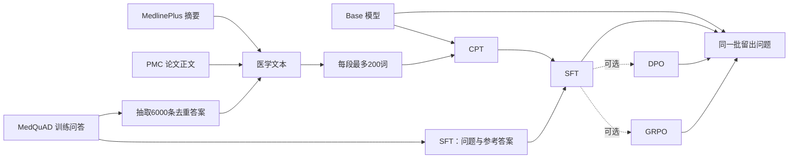

# 医学问答模型：研究与数据准备

**语言 / Language:** 简体中文 | [English](README.en.md)

更新：2026-10-08。已提交的 proposal 保留原稿；本文件记录实验方案、已完成的 CPT/SFT 和教授要求的基础模型对照。

## 项目要回答什么

我们选择 Qwen3.5-2B-Base，训练一个小型医学问答模型原型，研究它能否帮助线上医疗平台的工作人员起草常见健康问题的回答，再由工作人员审核。平台如果能以较低运行成本生成可用草稿，可能减少员工重复答疑的时间。它是课程实验，不用于诊断或替代医生。

主线是 **Base → CPT → SFT**：CPT（继续预训练）让模型读医学文本；SFT（监督微调）再让它根据问题生成答案。主比较是 Base 和最终 CPT+SFT 模型在同一批留出问题上的表现。这个比较衡量整个训练流程的变化，不能单独证明 CPT 比 SFT 多带来了多少提升；这与已提交 proposal 中“CPT+SFT 对比仅 SFT”的原计划不同，最终报告需要说明这次范围调整及原因。

DPO 和 GRPO 暂作可选扩展：如果时间、数据和 TensorFlow/Keras 工具链允许，就从同一个 SFT 检查点分别继续训练。DPO 需要“较好回答/较差回答”成对数据；GRPO 还需要明确、可信的奖励打分规则。目前这些数据、奖励方式和训练实现都未确定，不能算核心计划。

教授反馈已确认：至少 10,000 条医学文本或问答对满足数据要求；主要实验继续使用 TensorFlow/Keras/KerasHub，并必须补充课堂基础架构 baseline。我们使用从零训练的单向 LSTM：Embedding(128) → LSTM(256) → Dense，词表 20,000，参数量 8,094,240。它使用与 SFT 相同的 12,799 条训练问答和验证集。最终训练上限为 50 轮，按验证 loss 早停；实际完成 16 轮，最佳 checkpoint 为第 14 轮，并在相同 200 道测试题上与 Base、CPT+SFT 对比。命令见根目录 README，记录保存在服务器 `runs/lstm_qa_50epochs/run.json`。

LSTM 可以生成文字，但有限数据下的回答可能重复或不切题。它的单词 tokenizer 与 Qwen 子词 tokenizer 不同，因此 perplexity 只在 LSTM 自己的词表内报告，不能跨模型直接比较；128 个生成词和 128 个 Qwen 子词也不是相同长度预算。Qwen 的大规模预训练知识和模型规模都会影响结果，不能把差异全部归因于架构。Qwen 的 BERTScore/推理资源评测和完整 MMLU 医学子集已完成；人工答案审查仍待完成。

## 数据是什么样的

| 来源 | 原始内容与处理结果 | 当前用途 |
|---|---|---|
| [MedQuAD](https://github.com/abachaa/MedQuAD) | XML 来源文档中包含一条或多条问答。原压缩包有 11,264 个 XML 文件，其中 5,486 个至少含一条完整问答。清洗并去重后有 **16,359 对完整问答**：训练 12,799、验证 1,713、测试 1,847，按来源网址划分。 | SFT 仍使用全部 12,799 条训练问答。可供 CPT 使用的去重答案有 12,371 条；v3 固定随机抽取 6,000 条，降低答案文本在 CPT 中的占比。 |
| [MedlinePlus Health Topic XML](https://medlineplus.gov/xml.html) | 每个健康主题有标题、语言、网址和面向普通读者的摘要。下载版本日期为 2026-09-26，共 2,033 个主题；排除 187 个对应 MedQuAD 验证/测试页面的主题、非英文主题和缺摘要记录后，留下 827 个英文摘要：813 条训练、14 条验证。摘要中嵌入的 HTML 标签已剥除，保留其可见文字。 | 全部保留作 CPT；按每段最多 200 个空格分词切块后，训练集为 1,758 段、验证集为 50 段。 |
| [PMC Open Access](https://pmc.ncbi.nlm.nih.gov/tools/textmining/) | JATS XML 文章包含标题、摘要、分节正文和参考文献。我们从 MedQuAD 常见主题中抽取最多 20 个主题、每个最多 30 篇，并按文章元数据筛选 CC BY/CC0 许可。共选取 571 篇；清理时排除 9 篇更正、撤稿等声明类记录，留下 562 篇：502 篇训练、60 篇验证。提取标题、摘要和正文，跳过参考文献、表格等噪声。 | 文章正文按每段最多 200 个空格分词切块后，得到 13,118 段训练文本、1,595 段验证文本。PMC 许可因文章而异，逐篇许可记录保留在 manifest 中；[官方说明](https://pmc.ncbi.nlm.nih.gov/tools/textmining/)。 |

MedQuAD 的 SFT 原始记录有 `question`（问题）、`answer`（参考答案）及主题、来源网址等字段。CPT 则把一段文字作为学习材料：MedQuAD 用答案正文，MedlinePlus 用“主题标题 + 摘要”，PMC 用“论文标题 + 摘要 + 正文”。CPT JSONL 保存 `text`、来源、文档编号和许可等信息；较长文本会再拆成带 `chunk_index` 的小段。

格式示意（简化）：SFT 一行是 `{"question":"What is asthma?","answer":"Asthma is ..."}`；CPT 一行可以是 `{"text":"[论文正文的一段]","source":"PMC","document":"PMC...","chunk_index":3,"license":"CC BY"}`。CPT 使用了 512-token 输入长度；200 个空格分词的词数不等于 tokenizer 的 token 数，文本可能会被填充或截断。当前还没有单独统计被截断的比例。[KerasHub 文档](https://keras.io/keras_hub/api/base_classes/causal_lm_preprocessor/)说明了预处理方式。

## v3 CPT 配比

v3 CPT 训练集有 **24,240 段文本**：

- MedQuAD：从 6,000 条答案切出 9,364 段，来自 3,086 个 XML 来源文档。
- MedlinePlus：从 813 个健康主题切出 1,758 段。
- PMC：从 502 篇训练论文切出 13,118 段。

CPT 验证集有 1,645 段：MedlinePlus 50 段、PMC 1,595 段，对应 14 个 MedlinePlus 主题和 60 篇论文。MedQuAD 的 SFT 问答训练集没有抽样减少。

按空格分词粗略统计，训练文本共约 **407 万词**：PMC 约 257 万（约 63%）、MedQuAD 约 122 万（约 30%）、MedlinePlus 约 28 万（约 7%）。这不是模型 tokenizer 的 token 数。教授反馈已批准至少 10,000 条医学文本或问答对的口径；现有 12,799 条训练问答满足这一要求。CPT 另有 24,240 段训练文本、4,401 个来源编号，切块数与独立来源数仍分别报告。

## 数据怎样整理、怎样评测

原始 MedQuAD 划分保持不变。另生成去重后的 `qa_validation_eval.jsonl`（1,471 条）和 `qa_test_eval.jsonl`（1,573 条）。它们去掉了与 SFT 训练重复的问题或答案；当前检查是精确重复和部分完整答案匹配，还没有做语义近重复审查，不能保证所有知识重叠都已消除。

Base、CPT 和 CPT+SFT 评测使用相同的抽样问题和 Q/A 提示词。当前 Base/CPT+SFT 运行同时识别两种结束标记；历史 CPT-only 运行使用旧的停止配置。`evaluate_qa.py` 使用 `Question: {question}\nAnswer:` 提示词和贪心生成，输出 normalized exact match、token F1、ROUGE-L 和逐题答案，方便人工抽查相关性、信息遗漏及无依据说法。文字重合指标不代表医学正确；人工评分规则还要确定，也没有临床验证。

## 当前进度

- MedQuAD、MedlinePlus 和 571 篇 PMC 文章已下载；v3 CPT 数据已清理、抽样并切块。
- 当前清单是 `data/processed/cpt-medical-v3/manifest.json`。v1、v2 数据仍保留；原始文件和处理结果不纳入 Git，需要单独传到训练服务器。
- 2026-09-28，Qwen3.5-2B-Base 的 CPT 完成 1 个 epoch：24,240 条训练文本、1,645 条验证文本，序列长度 512、batch size 1、LoRA rank 8，峰值学习率 1e-4。训练 loss 为 0.920，验证 loss 为 1.229；token accuracy 分别为 0.570 和 0.538。这些是语言模型的下一个 token 预测指标，不是问答正确率。
- 完整 Hugging Face 格式模型导出到 `runs/qwen3_5_2b_cpt_full_1epoch/hf_export_multimodal`。导出基于 Base 快照 `b1485b2fa6dfa1287294f269f5fb618e03d52d7c`，合并了 12 个文本 q/v 投影权重，并原样保留 297 个视觉权重。训练目录保留 CPT adapter 和 `run.json`；导出目录含 `export_report.json` 与 `inference_check.json`。
- Transformers 检查成功加载 617 项权重，并完成了文本和图片推理。图片检查使用的是生成的纯色 PNG，所以只能说明模型能加载并接收图片输入；真实图片能力比较和人工问答质量评审尚未完成。
- SFT 已在服务器完成 1 个 epoch：12,799 条训练问答、1,471 条验证问答，sequence length 512、batch size 1、LoRA rank 8、learning rate 2e-5、639 warmup steps。验证 loss 为 0.6134，token accuracy 为 0.7025；训练 loss 为 0.5879，token accuracy 为 0.6993。这些是拼接问答文本的 next-token 指标，不是医学问答正确率。长样本可能被 512-token 长度截断，截断比例未统计。
- SFT 完整 Hugging Face 导出位于 `runs/qwen3_5_2b_sft_full_1epoch/hf_export_multimodal`。它将累计的 CPT+SFT LoRA 更新合并到原始 Base Safetensors 模型，并保留原始视觉权重。
- `evaluate_qa.py` 当前运行设置为同一提示词、贪心生成、最多 128 个新 token、随机种子 5565。以下保留四次 Qwen 配对评测，并加入 LSTM 在同一 200 道测试题上的结果；LSTM 行复用 CPT+SFT 测试运行中保存的 Base 回答：

  | Split | Candidate | Base token F1 | Candidate token F1 | Base ROUGE-L | Candidate ROUGE-L |
  |---|---|---:|---:|---:|---:|
  | Validation, n=200 | CPT | 0.2499 | 0.2345 | 0.1606 | 0.1639 |
  | Validation, n=200 | CPT+SFT | 0.2486 | 0.3421 | 0.1598 | 0.2702 |
  | Test, n=200 | CPT | 0.2540 | 0.2332 | 0.1582 | 0.1638 |
  | Test, n=200 | CPT+SFT | 0.2586 | 0.3248 | 0.1600 | 0.2622 |
  | Test, n=200 | LSTM, cached Base | 0.2586 | 0.2525 | 0.1600 | 0.2067 |

  上述结果的 normalized exact match 都为 0，且没有空回答。CPT 的 Token F1 低于同次 Base，ROUGE-L 略高；CPT+SFT 在这两个 200 题样本里的两项文字重合指标都高于同次 Base。这是初步结果，不证明医学回答正确。两次测试运行使用同一文件哈希、seed 和生成设置，但 Base 指标略有波动，因此应按每次运行内部的配对值解读，不要把不同运行的 Base 分数当成完全相同的基线。逐题回答和 JSON 汇总分别保存在服务器 `runs/qa_eval_*` 目录，不纳入 Git。

- 上表中的 QA 是早期逐次运行对比。EOS 修正后的 Base/CPT+SFT 指标和推理资源来自 `runs/qa_eval_cpt_sft_test_200_eosfix_wsl/`；该次运行使用相同测试文件、seed、提示词和生成上限，在 WSL RTX 2080 Ti 上完成。旧 RTX 4090 Infra 运行保留作历史记录。CPT-only 来自较早的 `runs/qa_eval_cpt_test_200/`，LSTM BERTScore 后续从保存回答补算，因此这些结果不是同一套 EOS 配置下的完整配对实验。旧 LSTM 对比中的缓存 Qwen 指标只作历史记录。文字和语义相似度仍不代表医学正确性。
- 最终 LSTM 训练使用 8,094,240 个参数、20,000 词词表、embedding 128、hidden size 256、sequence length 512、batch size 8、Adam 学习率 1e-3、Dropout 0.2、early-stopping patience 2，环境为 TensorFlow 2.21.0/Keras 3.15.1。最多训练 50 轮，实际完成 16 轮；验证 loss 最低的 checkpoint 是第 14 轮。训练、验证和保存共耗时 1,778.20 秒（约 29 分 38 秒）。该 checkpoint 的验证 loss 为 2.9958、token accuracy 为 0.5110，按有效目标词计算的 NLL 为 2.9100、word perplexity 为 18.356。词级 perplexity 不能与 Qwen 子词指标直接比较。
- LSTM 训练中有 657/12,799 条（5.13%）文本被截断，验证中为 102/1,471 条（6.93%）；未知词比例分别为 2.20% 和 3.62%。保存的完整 `model.keras` 为 97,164,406 字节（约 97.2 MB），包含训练用优化器状态；仅按 FP32 参数计算的权重约 32.4 MB，两者不能混作部署权重大小。
- 旧 LSTM 对比复用了另一次 Qwen 运行的预测，其 Base 指标与最终 Infra 运行不同，保留作历史参考。最终 LSTM 指标使用相同的 200 道题和参考答案；BERTScore 也已补算。LSTM 平均每题耗时 0.1242 秒，平均生成 86.115 个词；它的 128 词上限与 Qwen 的 128 子词上限不同，不能直接比较生成速度。
- 测试集共有 1,573 条记录，目前只评了按 seed 5565 抽取的 200 条；全量测试尚未运行。MedQuAD 是公开数据，但与训练数据来自同一数据集体系。
- MMLU `professional_medicine` 完整 272 题已使用 5-shot 提示完成评测。脚本从下一 token 概率中选择 A/B/C/D；test 标签不进入提示或训练。它是单科目考试评测，不是完整 MMLU 分数，也不证明患者问答质量；公开题目可能出现在预训练数据中。[MMLU 数据与原始实现](https://github.com/hendrycks/test)
- `main` 是已整合的课程主线，包含 CPT、SFT、LSTM 基线和评测。`runqi/sft-work` 保留给已有服务器 checkout；原 CPT 基线仍可通过标签 `cpt-baseline-2026-09-28` 访问。其余课程交付项见提交清单。
- 训练目标环境是 Linux GPU 服务器，依赖由 `uv` 管理；本机不需要启动 WSL 来准备或检查数据。

如果之后尝试 DPO 或 GRPO，二者都从同一个 SFT 检查点独立分支。开始前要确定偏好数据、奖励规则和评测集；不能只凭奖励分数上涨就断定回答质量提高。若工具链或数据来不及确认，完成 Base→CPT→SFT 主线即可。

## 最终留出集结果（更新于 2026-10-08）

EOS 修正版 QA 对比使用清理后 1,573 道测试题中按 seed 5565 抽取的 200 题。Base/CPT+SFT 来自 WSL RTX 2080 Ti 运行；CPT-only、LSTM 和 LSTM BERTScore 保留各自较早的结果。停止 ID 为 `248044`（`<|endoftext|>`）和 `248046`（`<|im_end|>`）。

| 模型 | Normalized EM | Token F1 | ROUGE-L F1 | BERTScore F1 |
|---|---:|---:|---:|---:|
| Base | 0 | 0.2571 | 0.1586 | 0.8382 |
| CPT | 0 | 0.2332 | 0.1638 | 未测量 |
| CPT+SFT | 0 | 0.3355 | 0.2749 | 0.8676 |
| LSTM | 0 | 0.2525 | 0.2067 | 0.8253 |

四个模型均无空回答。CPT-only 行来自旧的停止配置，仅作阶段参考；没有 SFT-only 对照，无法单独衡量 CPT 的贡献。完整 CPT+SFT 流程在 EOS 修正版运行的三项相似度指标上高于 Base。相似度指标不代表医学正确性。

实际的 KerasHub 预处理审计确认，12,799 条 SFT 训练样例的目标末尾都保留 `<|im_end|>`；其中 1,472 条达到 512-token 序列上限后也仍保留该标记。修正评测停止 ID 后，三道重点检查题仍未生成任何结束标记，并生成到 128-token 上限；临床试验题仍出现短语循环。这说明停止配置错误不是重复输出的唯一原因。评测结果没有逐题保存结束原因，因此尚不能估计全样本重复率；重训、chat-template SFT 和重复惩罚都还没有在本项目验证。

MMLU `professional_medicine` 完整科目使用 5-shot 提示：Base 为 165/272（60.66%），CPT+SFT 为 170/272（62.50%）。两者同对 149 题，只有 CPT+SFT 对 21 题，只有 Base 对 16 题，两者都错 86 题。单次、单科目净增 5 题。

EOS 修正版运行使用 WSL RTX 2080 Ti、batch size 1，每个模型预热 3 题。Base/CPT+SFT 平均延迟为 2.9805/2.4379 秒，P95 为 3.2475/3.2186 秒，生成速度为 42.7740/43.0036 tokens/s，峰值已分配显存为 4259.00/4259.38 MiB。CPT+SFT 平均输出更短（104.81 对 127.45 token ID）；硬件与旧 RTX 4090 运行不同，且输出长度也不同，因此不据此宣称提速。LSTM 以词计长度，延迟口径不能与 Qwen 直接比较。

本地报告已加入两组三模型回答对照：遗传方式（source line 823）和儿童 ALL 治疗（line 7），分别展示 CPT+SFT 答对核心信息、出现无依据的治疗描述，以及 LSTM 跑题。这些是选取的案例，不能代替系统性人工评审。

## 推荐阅读

- [BioMedLM: A 2.7B Parameter Language Model Trained On Biomedical Text](https://arxiv.org/abs/2403.18421)：参考医学文本训练后再做问答微调的阶段安排。论文从零训练，数据量和算力都远大于本项目，不照搬它的规模。
- [Don't Stop Pretraining: Adapt Language Models to Domains and Tasks](https://aclanthology.org/2020.acl-main.740/)：讨论如何让已有语言模型继续学习领域文本，再适应具体任务；适合理解本项目为什么安排 CPT。
